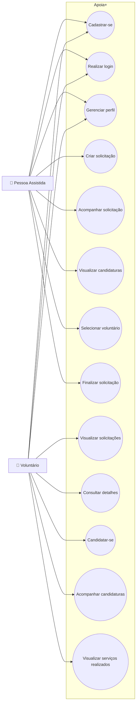

# 👥 Diagrama de Casos de Uso

O diagrama de casos de uso apresenta as principais interações dos dois tipos de usuários com o sistema Apoia+.

## Atores

### 🧓 Pessoa Assistida

Usuário que necessita de auxílio para realizar uma tarefa ou pequeno serviço.

### 🙋 Voluntário

Usuário que disponibiliza seu tempo e suas habilidades para ajudar outras pessoas.
