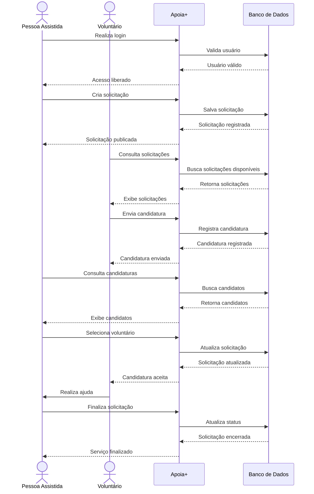

# 🔄 Diagrama de Sequência

O diagrama representa o fluxo principal do Apoia+, desde a criação de uma solicitação até a conclusão da ajuda.

```mermaid
sequenceDiagram
    actor Pessoa as Pessoa Assistida
    actor Voluntario as Voluntário
    participant Sistema as Apoia+
    participant Banco as Banco de Dados

    Pessoa->>Sistema: Realiza login
    Sistema->>Banco: Valida usuário
    Banco-->>Sistema: Usuário válido
    Sistema-->>Pessoa: Acesso liberado

    Pessoa->>Sistema: Cria solicitação
    Sistema->>Banco: Salva solicitação
    Banco-->>Sistema: Solicitação registrada
    Sistema-->>Pessoa: Solicitação publicada

    Voluntario->>Sistema: Consulta solicitações
    Sistema->>Banco: Busca solicitações disponíveis
    Banco-->>Sistema: Retorna solicitações
    Sistema-->>Voluntario: Exibe solicitações

    Voluntario->>Sistema: Envia candidatura
    Sistema->>Banco: Registra candidatura
    Banco-->>Sistema: Candidatura registrada
    Sistema-->>Voluntario: Candidatura enviada

    Pessoa->>Sistema: Consulta candidaturas
    Sistema->>Banco: Busca candidatos
    Banco-->>Sistema: Retorna candidatos
    Sistema-->>Pessoa: Exibe candidatos

    Pessoa->>Sistema: Seleciona voluntário
    Sistema->>Banco: Atualiza solicitação
    Banco-->>Sistema: Solicitação atualizada
    Sistema-->>Voluntario: Candidatura aceita

    Voluntario->>Pessoa: Realiza ajuda

    Pessoa->>Sistema: Finaliza solicitação
    Sistema->>Banco: Atualiza status
    Banco-->>Sistema: Solicitação encerrada
    Sistema-->>Pessoa: Serviço finalizado
```
