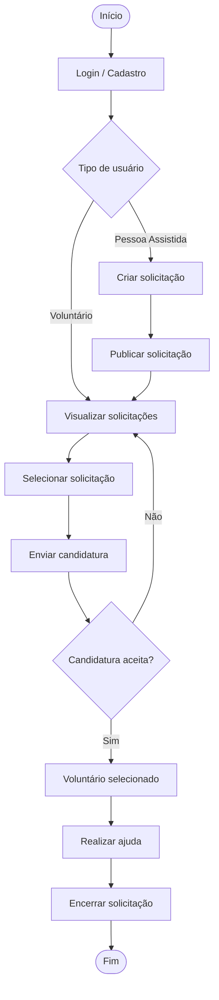

# 🔄 Fluxograma do Apoia+

## Descrição

O fluxo inicia com o cadastro ou login do usuário. Após o acesso, o sistema identifica se o usuário é uma **pessoa assistida** ou um **voluntário**.

A pessoa assistida pode criar e publicar uma solicitação de ajuda. Os voluntários podem visualizar as solicitações disponíveis e se candidatar àquelas que possuem interesse ou habilidade para realizar.

Após receber as candidaturas, a pessoa assistida escolhe um voluntário. A ajuda é então realizada e a solicitação é encerrada.
